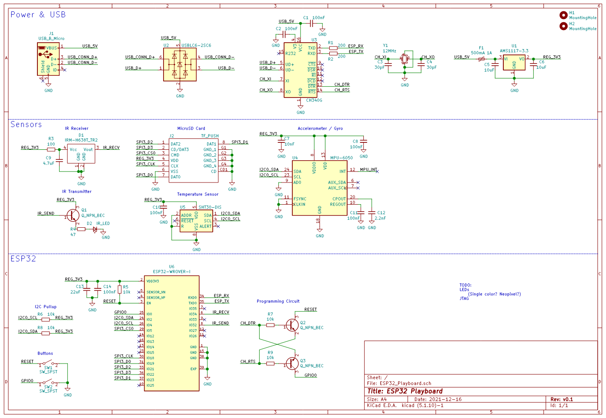
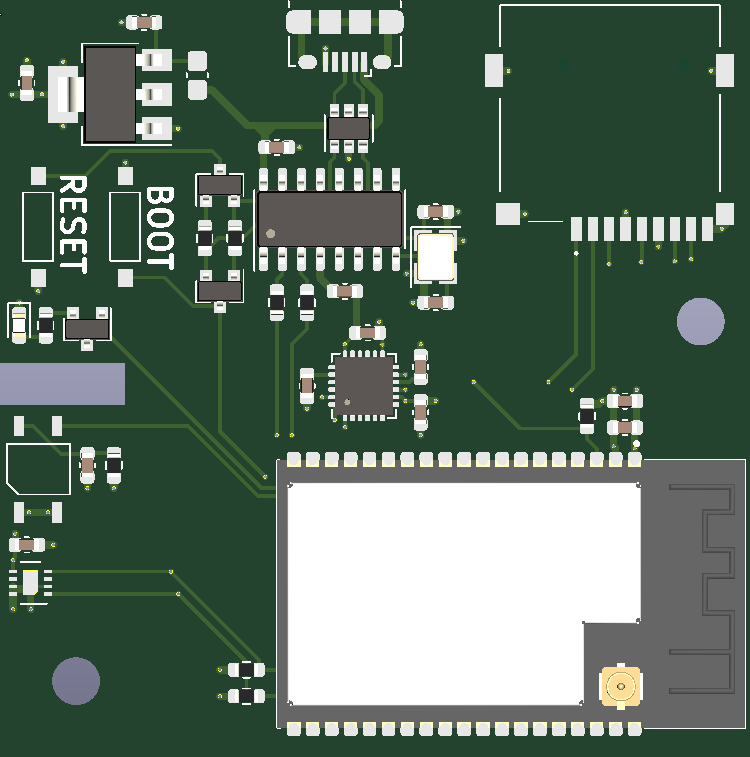

# ESP32 Playboard

I wasn't sure what to call this project other than the Playboard, so that's what it is. I got really into Espressif's [ESP-IDF](https://idf.espressif.com/) for developing on the ESP32, a dual core system running at 240MHz. The module that I chose has a 16MB SPI Flash chip and 8MB of PSRAM. 8MB and 4MB variants of the WROVER kit are also available, which can slightly reduce the price of it.

Using the LCSC BOM tool, a single board will cost ~$12, reducing to ~$8/board if making 100.

The Playboard includes the following sensors/devices:
- IR LED for Transmitting
- IR Receiver
- MicroSD Card Slot
- MPU-6050 IMU
- SHT30 Temperature/Humidity Sensor

In the PCB I added a small notch between the IR LED and the IR Receiver. This can be used to add a little divider to seperate them if simultaneous operation is required. Without a divider, the LED will be detected by the receiver.

## Schematic

Click to view full size PDF of schematic.

## PCB

## TODO

- JTAG Header
- Add some GPIO LEDs!
- Fill out the README more!